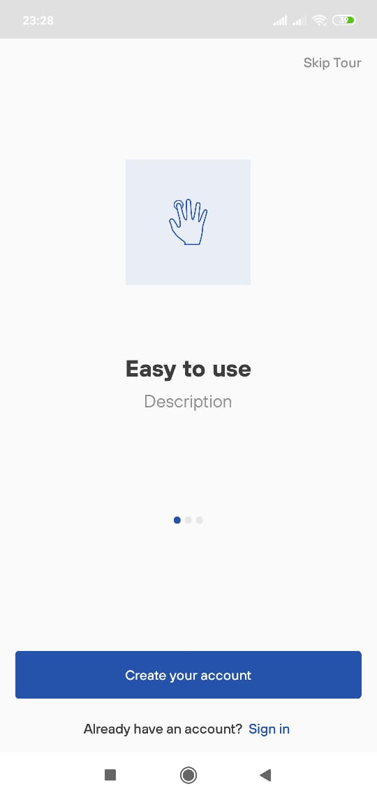
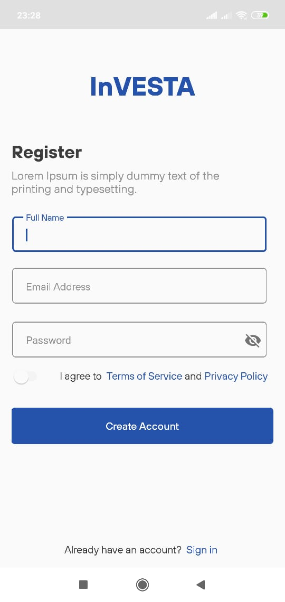
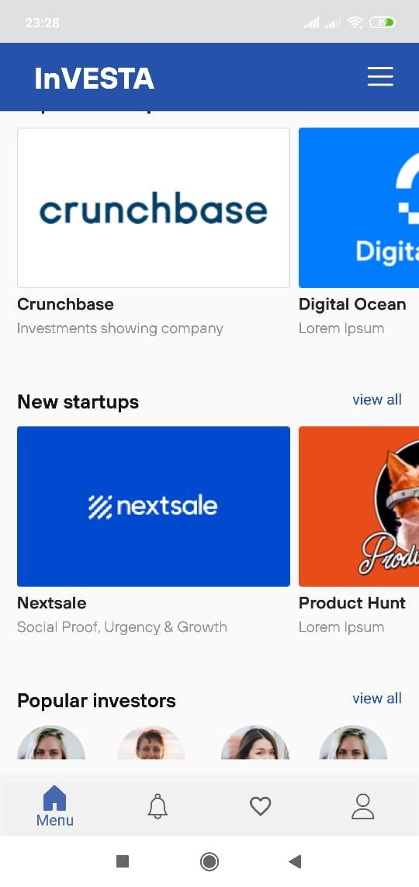
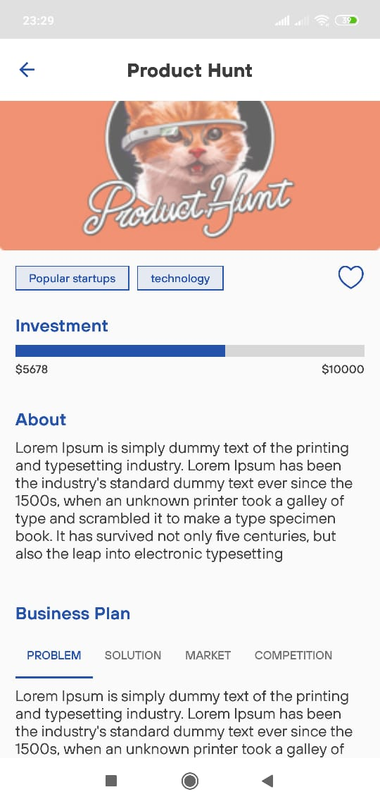
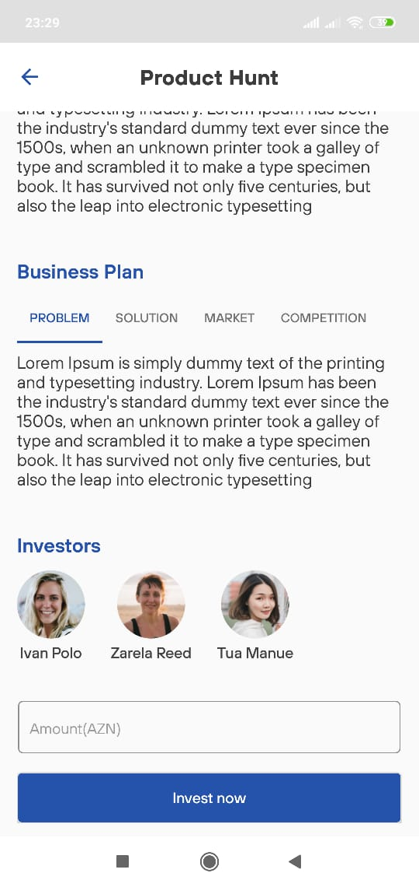
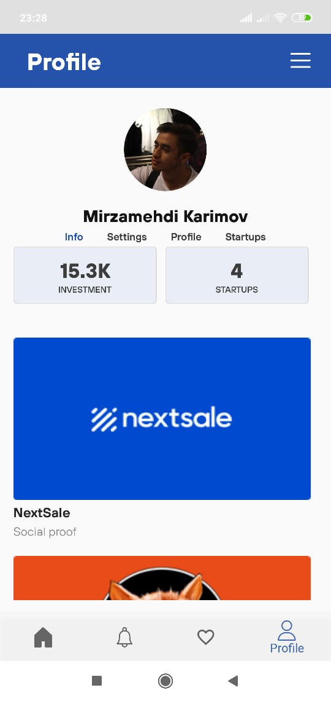

# inVesta
This is an Android application which brings up startupers and investors in one Platform.
This app is developed during IBA Hackathon   

 Some pictures from an app  

  
"  "
"  "   
"  "
"  "

### Installing
apk link:  https://github.com/mirzemehdi/inVesta/raw/master/apk/investa.apk

## Used Libraries
**CircleImageView**   
**Material Design**    
**PinView**   
**RecylerView**    
**CardView**      

### More Detail  

In this app investors and startupers or SME are in one platform which startupers can find investors easily and at the same time investors can invest any project. This is just some mockup view and wasn't connected to any API  

## Authors

----Developed by ***Mirzamehdi Karimov***----

